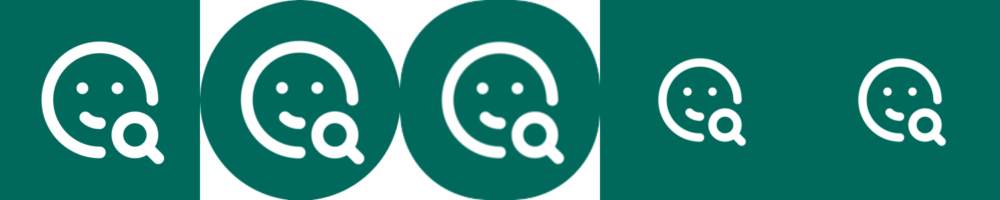

# UI 事项 9：应用图标与启动页

对应 `docs/agents/basic-info.md` 中「UI 构建」优先级列表的第 9 项：
「取代 Flutter 默认图标，添加启动页」。

## 本轮目标

把 Flutter 模板自带的蓝色 Flutter logo 全部换成项目自己的标志，并给两个平台都加上
品牌色启动页。图源只有一份 `assets/Appicon.svg`，其余全部由脚本从它派生出来。

范围决策：

- **图源、派生、接线三者分开**。`assets/Appicon.svg` 是唯一手工维护的源；
  所有 PNG（Android 传统图标 / 自适应前景 / 启动页图形、iOS 图标 / 启动页图形）都由
  `tool/generate_icons.ps1` 重新生成；平台接线（`mipmap-anydpi-v26`、`launch_background.xml`、
  `LaunchScreen.storyboard`）是仓库里的手写文件。换图标 = 换 SVG 再重跑脚本，不碰后面两层。
- **不引第三方图标 / 启动页插件**（不引 `flutter_launcher_icons` / `flutter_native_splash`）。
  理由：这两个包只是把同一批 PNG 写进同一批目录，却要多一份 pub 依赖和一套 YAML 配置；
  本项目已经有 ImageMagick 可用，一个 200 行的 PowerShell 脚本能做到同样的事，而且不联网。

## 交付内容

| 部分 | 说明 |
| --- | --- |
| 生成脚本 | 新增 `tool/generate_icons.ps1`：SVG → 43 个 PNG，可重入（重复跑就地覆盖） |
| Android 传统图标 | `mipmap-{m,h,xh,xxh,xxxh}dpi/ic_launcher.png`（48/72/96/144/192），品牌底 + 圆角 |
| Android 自适应前景 | `mipmap-*/ic_launcher_foreground.png`（108/162/216/324/432，即 108dp 画布） |
| Android 自适应接线 | 新增 `mipmap-anydpi-v26/ic_launcher.xml`（此前这个目录是**空的**，自适应图标一直没接上） |
| Android 启动页图形 | `drawable-*/launch_image.png`（128/192/256/384/512，透明底白描边） |
| Android 启动页接线 | `drawable/` 与 `drawable-v21/launch_background.xml` 改成品牌底 + 居中图形 |
| Android 12+ 启动页 | 新增 `values-v31/styles.xml`、`values-night-v31/styles.xml` |
| iOS 图标 | `AppIcon.appiconset/` 下 15 个 PNG 覆盖（20…1024，**不带 alpha 通道**） |
| iOS 启动页图形 | `LaunchImage.imageset/LaunchImage{,@2x,@3x}.png`（120/240/360，透明底白描边） |
| iOS 启动页接线 | `LaunchScreen.storyboard`：背景改品牌色、`<image>` 尺寸 168×185 → 120×120 |

## 文件清单

```
assets/
  Appicon.svg                    图源，本轮未改动

tool/
  generate_icons.ps1             图标 / 启动页图片生成脚本（新增）

android/app/src/main/res/
  values/colors.xml              brand_color = #00695C（新增）
  mipmap-anydpi-v26/ic_launcher.xml          自适应图标 XML（新增）
  mipmap-*/ic_launcher.png       5 个，覆盖 Flutter 默认图标
  mipmap-*/ic_launcher_foreground.png        5 个（新增）
  drawable-*/launch_image.png    5 个（新增）
  drawable/launch_background.xml            改写（原为 @android:color/white）
  drawable-v21/launch_background.xml        改写（原为 ?android:colorBackground）
  values-v31/styles.xml         Android 12+ 系统启动画面底色（新增）
  values-night-v31/styles.xml   同上，深色模式（新增）

ios/Runner/
  Assets.xcassets/AppIcon.appiconset/*.png   15 个，覆盖 Flutter 默认图标
  Assets.xcassets/LaunchImage.imageset/LaunchImage*.png   3 个，覆盖默认占位图
  Base.lproj/LaunchScreen.storyboard        改写背景色与 <image> 声明尺寸
```

## 脚本设计要点

- **描边颜色在渲染前替换**。`assets/Appicon.svg` 是 Tabler 风格 stroke 图标，
  描边写的是 `stroke="currentColor"`；librsvg（ImageMagick 的 SVG 解码器）没有 CSS 继承上下文，
  会把它当成黑色。脚本先把 `currentColor` 文本替换成 `$GlyphColor` 写一份临时 SVG，
  **源文件保持原样**——这样 SVG 里不必硬编码颜色，图标换个色只传参数。
- **底色不由 SVG 提供**。底图是 ImageMagick 现画的：`square` = `xc:#00695C` 满幅；
  `rounded` = `roundrectangle 0,0,N-1,N-1,corner,corner`，`corner = round(2 × Size × 0.22)`。
  圆角只有 Android 旧版看得见（iOS 由系统裁圆角、Android 8+ 由自适应遮罩裁）。
- **栅格化倍率**：SVG 声明宽 32px，`-density 96` 就是 32px，所以脚本按目标边长的
  **4 倍**栅格化（`-density = 12 × Box`）再 `-resize` 回来。直接按 20~48px 这种小尺寸栅格化
  锯齿明显，放大 4 倍再缩回来干净得多。
- **入口是 `magick.exe`，不是 `convert`**：`C:\Windows\system32\convert.exe` 是 Windows 的
  磁盘转换工具，会顶掉 ImageMagick 6 时代的同名命令。脚本先查 PATH，再扫
  `%ProgramFiles%` / `%ProgramFiles(x86)%` / `%LOCALAPPDATA%\Programs` 下的 `ImageMagick*` 目录，
  也可用 `-MagickPath` 指定。
- **两个比例常量是算出来的，不是调出来的**：
  - 传统图标 `$IconGlyphRatio = 0.70`：图形框占画布 70%，实际着墨约 61%。
  - 自适应图标 `$AdaptiveGlyphRatio = 0.47`：108dp 画布里只有中间 66dp 的圆（半径 33dp）
    是「任何遮罩下都不被裁」的。图形着墨最远端在图形框的 `(23,23)` 处（放大镜柄端点，
    22 再加 1 单位圆头），换算到画布中心是 `11/24 × √2 ≈ 0.648 × 图形框边长`，
    于是 `0.648 × (108 × r) ≤ 33 → r ≤ 0.4715`，取 0.47。
    **这个值的另一个含义**：遮罩区 72dp 里图形框占 `50.8/72 ≈ 70%`，与传统图标的 70% 一致，
    两种图标摆在同一个桌面上看起来才会一样大。
    初版取 0.54 是试出来的，圆形遮罩下放大镜柄的圆头会被切平（见下方「验证」）。
- **iOS 图标必须去掉 alpha 通道**：用 `PNG24:` 前缀输出，而不是 `PNG32:`。
  带透明通道的 App Store 图标会被拒。命令行核查：`magick identify -format "%[opaque]"` 全为
  `True`、`%[channels]` 为 `srgb 3.0`。
- **iOS 启动页图形按点数出图**：`LaunchScreen.storyboard` 里 imageView 是 `contentMode="center"`，
  图片按 1x 的点数原样居中，所以 1x 的 120px 就是屏幕上的 120pt，
  storyboard 里 `<image name="LaunchImage" width="120" height="120"/>` 必须与之一致
  （模板原本写的是 Flutter logo 的 168×185）。
- **Android 12（API 31）起启动画面改由系统 SplashScreen API 接管**，
  `LaunchTheme` 的 `android:windowBackground` 不再用来画启动窗口——只改
  `launch_background.xml` 的话，Android 12+ 上会先闪一下主题默认的白底再进应用。
  所以额外加了 `values-v31` / `values-night-v31` 把 `android:windowSplashScreenBackground`
  指成 `@color/brand_color`；图标不另外指定，沿用系统默认的应用图标
  （自适应图标本身已限制在安全区内）。
- **深色模式下刻意也用品牌色**：`drawable-v21/launch_background.xml` 原来用的是
  `?android:colorBackground`，改为固定的 `@color/brand_color`，与 iOS 的 storyboard 底色、
  应用图标底色三者一致。启动画面只是一闪而过的品牌露出，不必跟随深浅色。

## 成品预览



从左到右：iOS 1024 图标 / Android 自适应图标（按 72dp 圆形遮罩合成）/ Android 传统图标（xxxhdpi）/
iOS 启动页 / Android 启动页。换图源后这张图会过时，需要重新生成。

## 验证

- 脚本运行：识别到 `C:\Program Files\ImageMagick-7.1.2-Q16-HDRI\magick.exe`，
  43 个文件全部生成成功。
- 尺寸与通道核查（`magick identify`）：
  - Android `ic_launcher.png` = 48/72/96/144/192；`ic_launcher_foreground.png` = 108/162/216/324/432；
    `launch_image.png` = 128/192/256/384/512。
  - iOS `AppIcon.appiconset` 15 个尺寸与 `Contents.json` 一一对应，**全部不带 alpha**。
  - iOS `LaunchImage` = 120/240/360，带 alpha（透明底）。
- 视觉核查（把成品放大到 400~600px 看）：
  - 传统图标在 48px 下图形清晰可辨（眼睛是 2~3px 的小点，仍是两个点）。
  - 自适应前景按 108dp 画布中央 72dp 的**圆形**遮罩合成后，
    图形完整落在圆内，放大镜柄的圆头不再被切（0.54 那版被切平，已改 0.47）。
- `flutter build apk --debug` 通过（31.2s），产出 `build\app\outputs\flutter-apk\app-debug.apk`。
  这一步同时验证了 Android 侧新增的 `@color/brand_color`、`@drawable/launch_image`、
  `@mipmap/ic_launcher_foreground` 三处引用全部能解析、`values-v31` 限定符合法。
- **未做**：真机 / 模拟器上看启动页实际观感；iOS 未经 Xcode 构建验证。

## 注意事项（后继 Agent 必读）

- **不要手工改 `res/mipmap-*/` 与 `Assets.xcassets/` 下的 PNG**——它们是生成物，
  下次跑脚本会被覆盖。要改就去改 `assets/Appicon.svg` 或脚本里的比例常量，然后重跑：
  `pwsh -NoProfile -File tool/generate_icons.ps1`
- **改品牌色要改两处**：`tool/generate_icons.ps1 -BrandColor`（默认 `#00695C`）
  **和** `android/app/src/main/res/values/colors.xml` 的 `brand_color`。
  两者目前一致，也都是 `lib/theme/app_theme.dart` 的 `seedColor`，
  但脚本不去读 Dart 文件——这层同步是手工的。
- 脚本不依赖网络，也不依赖 Flutter；只要本机装了 ImageMagick 7 就能跑。
- 换图源时注意：脚本按「24×24 视框、图形满铺、描边 `currentColor`」的假设配色与定比例。
  换成几何范围不同的 SVG（比如图形只占视框一半）会让所有比例失真，此时要重算
  两个 `*GlyphRatio`，尤其是自适应那个 0.47 的安全区推导。
- `mipmap-anydpi-v26/` 在本轮之前**是空目录**（仓库里存着但没有任何文件），
  即 Flutter 模板的默认图标一直是靠 `mipmap-*/ic_launcher.png` 这张位图显示的。
  以后若要加圆形图标，需要另外给 `mipmap-anydpi-v26/ic_launcher_round.xml`
  并在 `AndroidManifest.xml` 里补 `android:roundIcon`（当前清单里没有这一项）。
